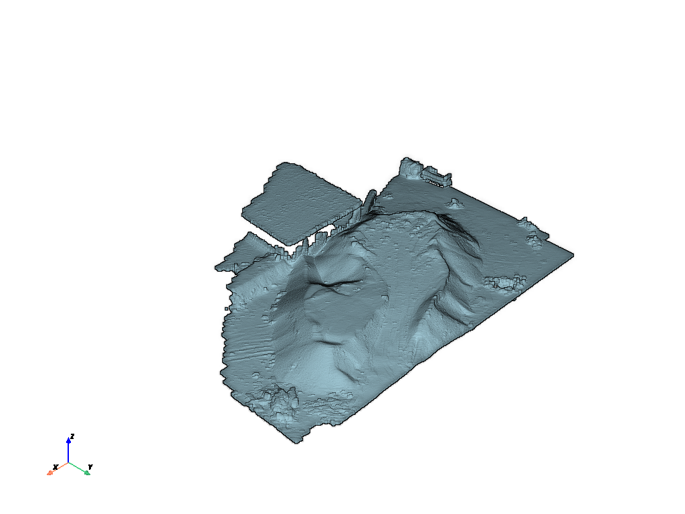

# Another mathematical programming with visualization

 ## Contents
<!-- -->
- [set up](#set-up)
- [Codes](#codes)
    - [configuration file](#configuration-file)
    - [python files](#python-files)
        - [readAndPlot](#readandplot)
        - [groundDetection](#grounddetection)
        - [statistical_Outlier_Removal_filter](#statistical_outlier_removal_filter)
        - [DBSCAN](#dbscan)
        - [shadow](#shadow)
        - [main](#main)
- [Documents](#documents)
- [Exports](#exports)
    - [numpy files](#numpy-files)
        - [afterSOR](#aftersor)
        - [big_part](#big_part)
        - [combined_points](#combined_points)
- [Information_Data](#information-data)
    - [task_rs_pc](#task_rs_pc)
    - [task_subset](#task_subset)


# set up:

We use Python environment variables to avoid configuration issues and etc.
```
$ python -m venv env
$ source env/bin/activate
```
To use the program, we navigate to the desired directory with cd!
  ```
$ cd Task_Fatemetarashi/
```
 We see four directories:
- Codes
- Documents
- Exports
- Information_Data 

<!-- -->
# Codes
- cp.cfg
- cp.py

## configuration file
Due to the fact that our ".las" file is a part of the whole and because paths are not hardcoded in the program, we have the configuration file cp.cfg

## python files
Due to the fact that we have multiple files and probably we want to perform tasks in parallel, as well as the limited power of my laptop, we have several Python files! 

### readAndPlot
This file contains 2 functions:
#### plot_las_file
Reads the initial cloud points from the .las file and displays them. like our .las file:

#### plot_npy_file
Reads the numpy array cloud points from the .npy file and displays them.

### groundDetection
This file contains 3 functions:
#### threshold_height
#### ground_detection
####  non_ground_detection


### statistical_Outlier_Removal_filter
### DBSCAN
### shadow
### main

<!-- -->
# Documents
We have a README file in Markdown format in this directory. If you are having trouble viewing this file, you can use [Grip](https://github.com/joeyespo/grip)  or similar tools.

<!-- -->
# Exports 

## numpy files

### afterSOR
### big_part
### combined_points

<!-- -->
# Information_Data
## task_rs_pc
The pdf file contains the purpose of this repository, i.e. the problem and its indicators
## task_subset  
The .las file contains the cloud point, a subset of a larger data cloud.

